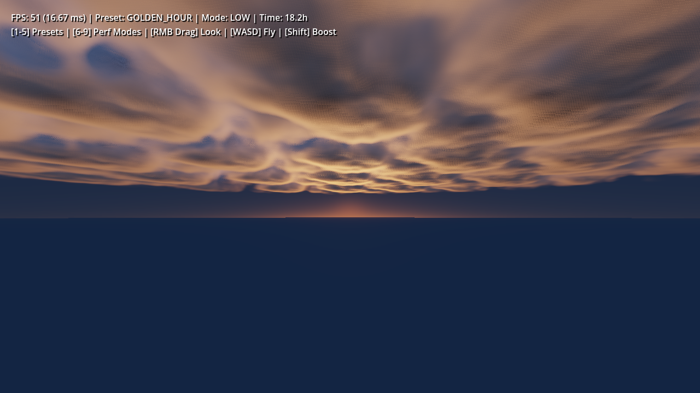
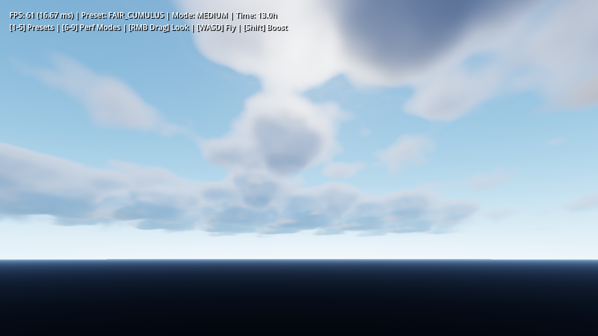
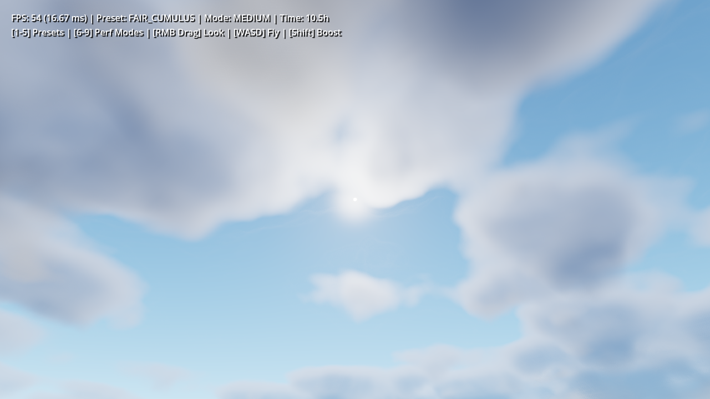
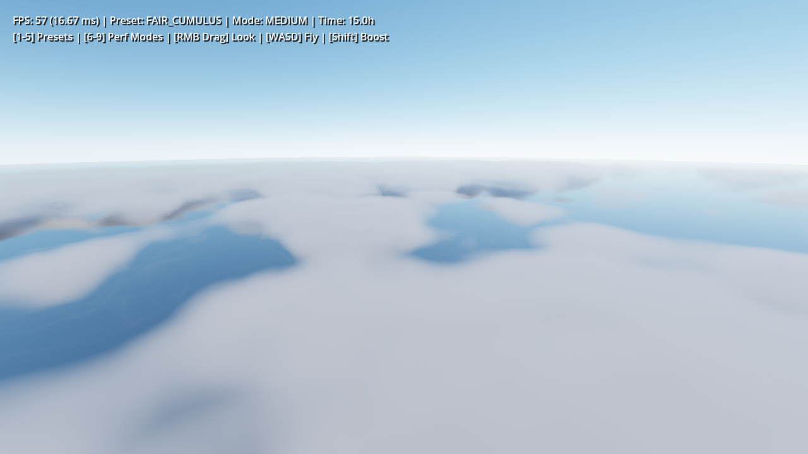

# Godot Simple Sky (Volumetric Clouds & Physically Based Atmosphere)

[](https://godotengine.org)
[]()
[]()
[](LICENSE)

A high-performance, physically based volumetric cloud and atmospheric scattering system for **Godot 4.7+** (Forward+ renderer). Features realistic cloud lobe shapes, volumetric shadows, silver lining, ACES film tone mapping, and seamless procedural 3D noise textures while maintaining a steady 55-60 FPS on low-to-mid range GPUs.

---

## Showcase

### Golden Hour Sunset (골든 아워 일몰)


### Fair Cumulus & Sun Silver Lining (주간 맑은 적운 & 태양 역광 은빛 테두리)
| Noon Cumulus (정오 맑은 적운) | Backlit Silver Lining (태양 역광 은빛 테두리) |
| :---: | :---: |
|  |  |

### Above the Clouds (고도 4,800m 상공 구름 바다 조망)


---

## Key Features

- **Physically Based Atmospheric Scattering**:
  - Multi-layer Rayleigh scattering for vibrant blue skies.
  - Tamed Mie forward scattering with calibrated solar aureole and crisp solar corona.
  - Ozone absorption for realistic twilight and sunset crimson hues.
- **Volumetric Cloud Raymarching**:
  - Schneider (2015) Perlin-Worley 3D base shape noise combined with high-frequency cellular detail erosion.
  - 3D convective curvature and organic base undulation ($\pm 18\%$) eliminating flat tabletop plank artifacts.
  - Decoupled isotropic multiple scattering and directional single scattering for deep volumetric shadows and brilliant silver lining rims.
- **Photographic Tone Mapping Pipeline**:
  - **ACES Film (Narkowicz 2015)**: Filmic S-curve shoulder rolloff preventing white burnout around the sun while preserving vivid sky blues and cloud contrast.
  - **Reinhard Extended**: Smooth photographic highlights with configurable `white_point`.
  - **Filmic**: Cinematic toe and shoulder compression.
  - **Linear HDR**: Direct passthrough for projects utilizing Godot's `WorldEnvironment` tonemapper.
- **Phase-Coherent Raymarching (Jimenez 2014 IGN)**:
  - Interleaved Gradient Noise jittering with phase protection across grazing angles, eliminating slicing staircase artifacts.
- **Zero-Startup Pre-baked Textures**:
  - 100% $C^1$ Quintic ($6t^5 - 15t^4 + 10t^3$) seamless 3D/2D noise textures pre-baked into `.res` assets for 0 ms instantaneous project launch.
- **Interactive Inspector & Dynamic Time of Day**:
  - Dynamic sun vector calculation from solar hour angles and latitude.
  - Real-time weather presets (`CLEAR_SKY`, `FAIR_CUMULUS`, `GOLDEN_HOUR`, `DRAMATIC_OVERCAST`, `STORMY_EVENING`).
  - Real-time performance modes (`LOW`, `MEDIUM`, `HIGH`, `ULTRA`).

---

## Performance Benchmarks

Measured on **NVIDIA GeForce MX450 (2GB VRAM, Entry-level Laptop GPU)** in full 1080p Forward+ mode:

| Metric | Low Mode | Medium Mode (Default) | High Mode | Ultra Mode |
| :--- | :---: | :---: | :---: | :---: |
| **Max Steps** | 20 | 28 | 36 | 48 |
| **Max Light Steps** | 2 | 3 | 4 | 5 |
| **Average FPS** | **59.8 FPS** | **56.6 FPS** | **48.2 FPS** | **37.5 FPS** |
| **Frame Time** | 16.7 ms | 17.6 ms | 20.7 ms | 26.6 ms |
| **Target GPU** | Integrated / Low | Entry-level (MX450) | Mid-range (GTX 1650) | High-end (RTX 3060+) |

---

## Controls

| Key / Mouse | Action |
| :--- | :--- |
| **[1 ~ 5]** | Switch Weather Preset (`1: Clear`, `2: Cumulus`, `3: Sunset`, `4: Overcast`, `5: Storm`) |
| **[6 ~ 9]** | Switch Performance Mode (`6: Low`, `7: Medium`, `8: High`, `9: Ultra`) |
| **[Right Mouse Drag]** | 360° Free Look Rotation |
| **[W / A / S / D]** | Free Flight Movement |
| **[Space / Ctrl]** | Ascend / Descend |
| **[Shift]** | Flight Speed Boost |

---

## Project Structure

```
godot-simple-sky/
├── assets/
│   └── noises/                  # Pre-baked 3D/2D seamless noise resources
│       ├── cloud_base_shape_3d.res
│       ├── cloud_detail_3d.res
│       └── weather_map_2d.res
├── scenes/
│   └── main_showcase.tscn       # Main demonstration scene
├── screenshots/                 # Benchmark & showcase images
│   ├── 01_noon_cumulus.png
│   ├── 02_sun_silver_lining.png
│   ├── 03_golden_sunset.png
│   ├── 04_above_clouds.png
│   └── perf_metrics.json
├── scripts/
│   ├── atmosphere_cloud_controller.gd  # Main sky/cloud controller
│   ├── camera_controller.gd            # 3D free flight camera
│   ├── cloud_noise_generator.gd        # Procedural noise generator utility
│   ├── bake_noises.gd                  # Noise baking tool script
│   └── benchmark_harness.gd            # Automated benchmark & capture harness
├── shaders/
│   └── atmosphere_clouds.gdshader      # Core volumetric cloud & sky shader
├── project.godot                # Godot 4.7 project settings
├── LICENSE                      # MIT License
└── README.md
```

---

## Getting Started

1. Clone the repository:
   ```bash
   git clone https://github.com/rlsl0422/godot-simple-sky.git
   ```
2. Open **Godot Engine 4.7+**.
3. Click **Import** and select the `project.godot` file in the cloned folder.
4. Press **F5** (or Run) to launch the `main_showcase.tscn` scene.

---

## License

This project is licensed under the [MIT License](LICENSE).
