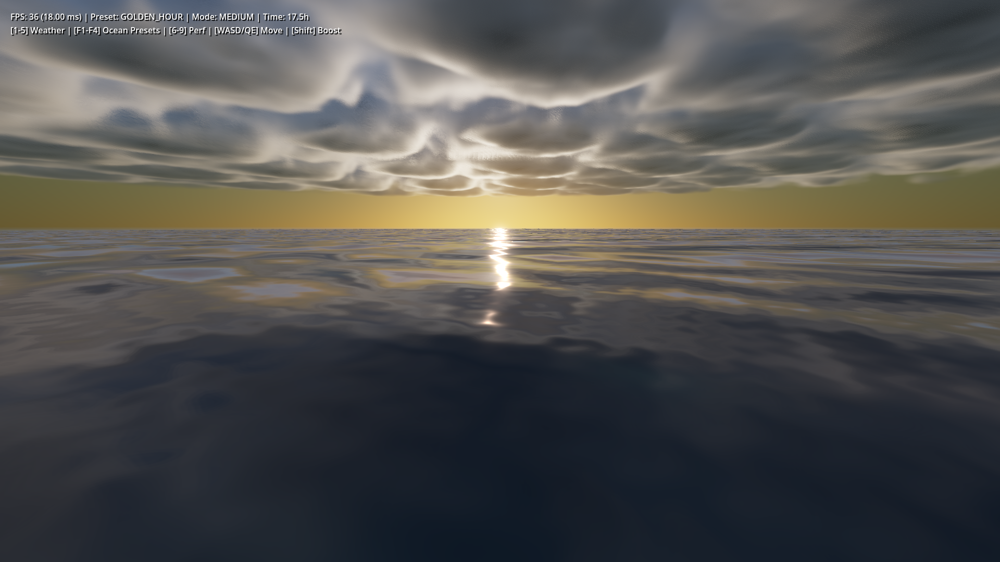
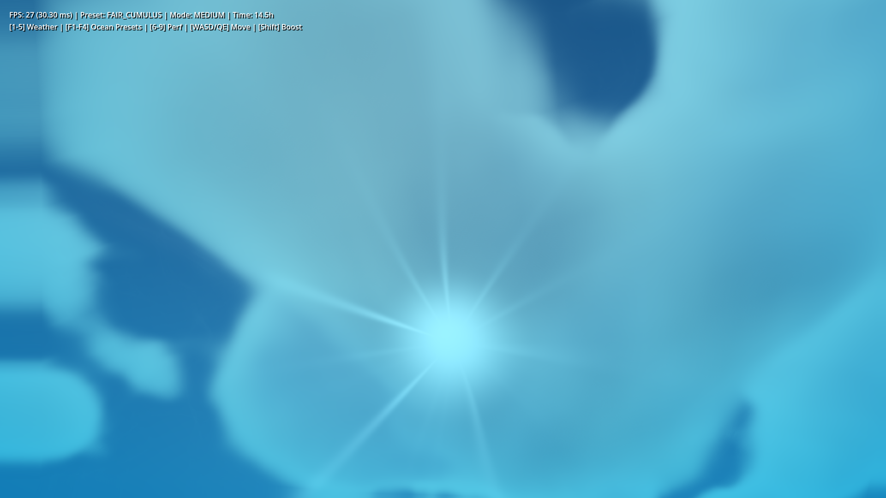
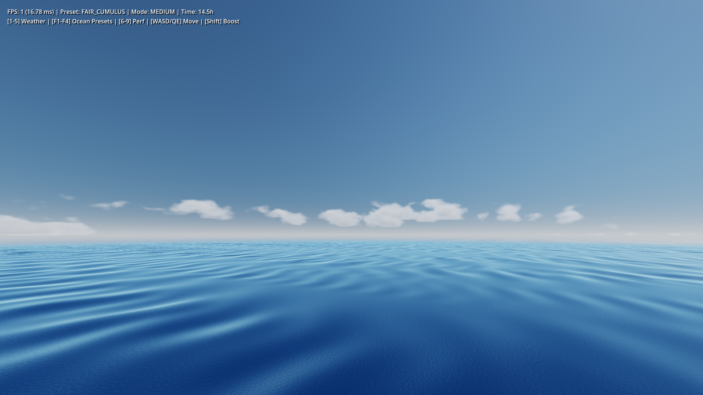
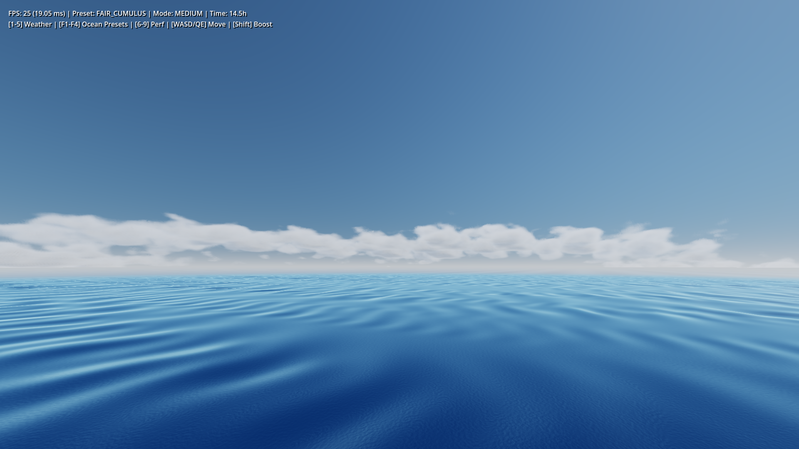
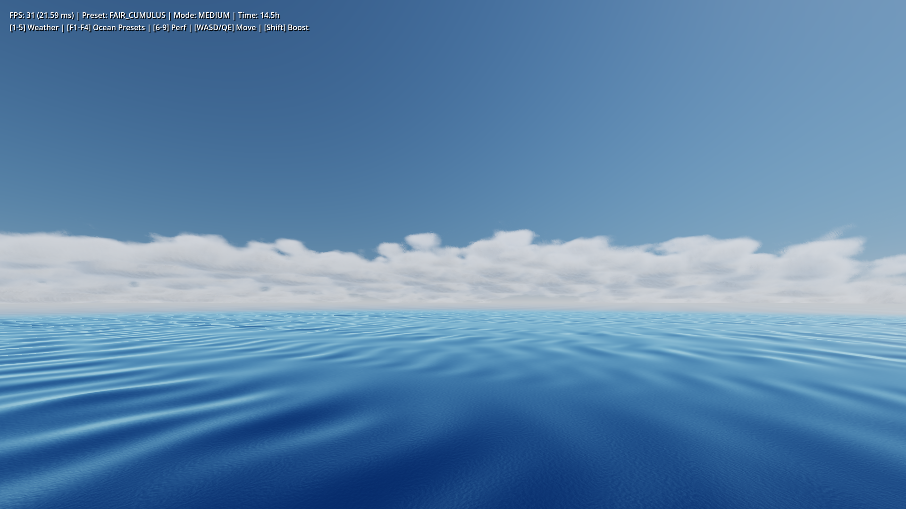
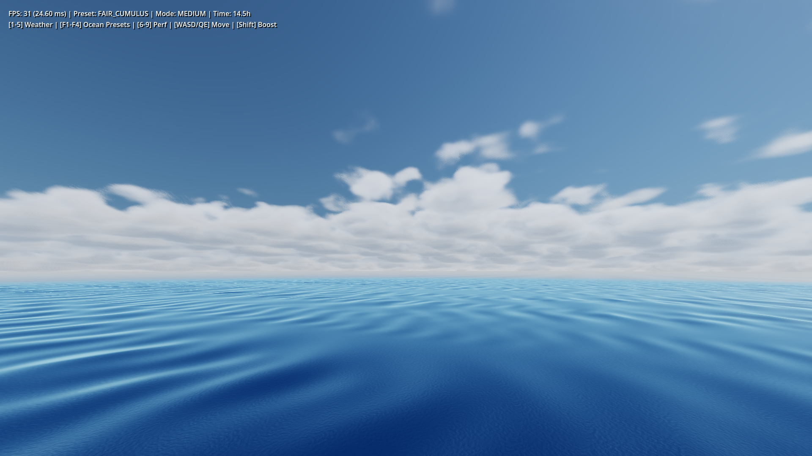
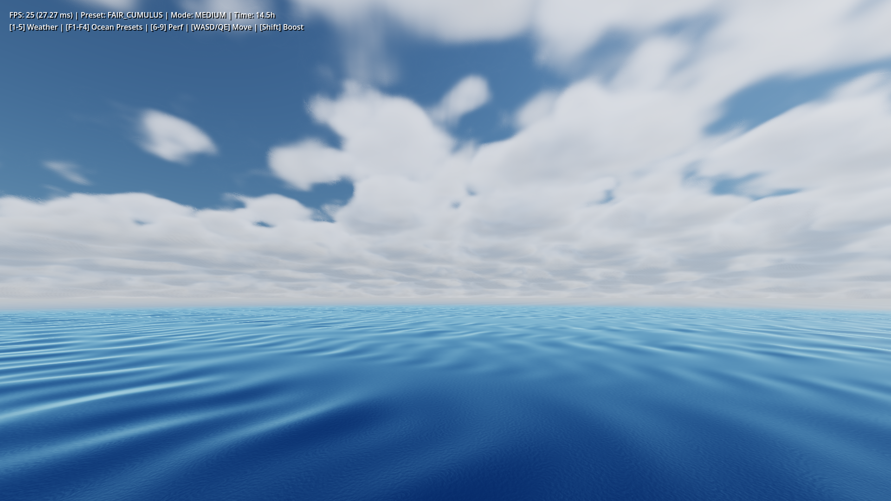

# Godot Simple Sky & Ocean (Volumetric Clouds, Atmosphere & Ocean Simulation)

[](https://godotengine.org)
[]()
[]()
[](LICENSE)

A high-performance, physically based volumetric cloud, atmospheric scattering, and infinite ocean simulation system for **Godot 4.7+** (Forward+ renderer). Features hierarchical cloud clumping, organic cauliflower billows, dynamic lifting condensation shelves, volumetric silver lining, realistic ocean surface optics, underwater extinction, and seamless procedural noise textures while maintaining steady real-time framerates on entry-to-mid range GPUs.

---

## Showcase

### Clustered Cumulus & Summer Sky (군집형 적란운 & 청명한 여름 하늘)


### Golden Hour & Infinite Ocean (골든 아워 일몰 & 무한 바다 시뮬레이션)
| Golden Hour Sunset (일몰 하늘) | Infinite Ocean Horizon (무한 수평선 바다) |
| :---: | :---: |
|  |  |

### Physical Underwater Optics & High Altitude View (물리 기반 수중 광학 & 고고도 조망)
| Underwater Godrays (-2.5m 수중 산란광) | Above the Clouds (4,800m 상공 운해) |
| :---: | :---: |
|  |  |

---

## Cloud Coverage Progression (커버리지 단계별 군집화 검증)

구름 커버리지(`cloud_coverage`) 변화에 따라 구름이 하늘 전체를 균일하게 덮지 않고, 웅장한 모체 코어를 중심으로 새끼 구름들이 군집(Cluster)을 형성하며 푸른 하늘 통로가 자연스럽게 유지됩니다.

| 0.32 (Sparse Islands) | 0.35 (Developing Cumulus) | 0.38 (Balanced Archipelago) | 0.41 (Towering Masses) | 0.44 (Grand Formations) |
| :---: | :---: | :---: | :---: | :---: |
|  |  |  |  |  |

---

## Key Features

### 1. Hierarchical Volumetric Clouds (계층적 볼륨 구름 및 군집화)
- **Macro Cluster Gating ("구름끼리 서로 뭉치게")**:
  - 기상도 기반 거시 게이팅으로 하강 기류 구역은 100% 맑은 푸른 하늘로 비우고, 상승 기류 구역에만 거대 군집(Archipelago)을 형성.
- **Mother Core + Flank Baby Cloudlets**:
  - 중심부의 웅장하고 단단한 모체 코어(Mother Core)와 그 어깨 및 능선을 따라 콜리플라워처럼 피어나는 보송보송한 새끼 구름(Baby Cloudlets)의 유기적 결합.
- **Flat Lifting Condensation Level (LCL)**:
  - 밑면이 위로 파고들던 잘록한 허리 왜곡(Hourglass Waist)을 제거하고 수평 응결면을 확립하여 낮은 커버리지에서도 자연스러운 밑면 형성.
- **Zenith Sky Clearance**:
  - 머리 위(Zenith)에는 시원한 푸른 하늘 통로를 열어두고, 수평선 쪽에 웅장한 여름철 적란운 일러스트 구도 연출.
- **Anti-Tiling Domain Warp**:
  - 3D 비주기적 컬 왜곡(Curl/Twist Warp)으로 반복적인 벽지 타일링 패턴을 완전 차단.

### 2. Physically Based Atmospheric Scattering (물리 기반 대기 산란)
- **Multi-layer Rayleigh & Mie Scattering**:
  - 고도별 분자 밀도 모델링을 통한 선명한 주간 블루 및 부드러운 태양 주변 아우레올(Aureole) 연출.
- **Ozone Absorption**:
  - 오존층의 빛 흡수를 시뮬레이션하여 일몰 및 황혼기의 짙은 크림슨/마젠타 노을 구현.
- **Decoupled Multiple Scattering & Silver Lining**:
  - 다중 전방 산란(Multiple Scattering)으로 구름 내부의 진주빛 산란광과 역광 시의 찬란한 은빛 테두리(Silver Lining) 표현.

### 3. Infinite Planetary Ocean & Underwater Optics (행성 바다 및 수중 광학)
- **Dynamic Gerstner Waves & Horizon Blending**:
  - 주/부 방향 파도 스펙트럼과 물리적 프레넬(Fresnel) 반사, 대기 원경 헤이즈와 완벽히 융합되는 수평선 블렌딩.
- **Jerlov Physical Water Extinction**:
  - 수심에 따른 빛 감쇄(적색광 급격 감쇄, 청록색 잔류) 및 수중 갓레이(Godrays) 광학 포스트 프로세스 지원.
- **Anti-Solar Fix**:
  - 태양 반대편 시야각에서도 방사형 그물망 아티팩트 없이 맑고 깨끗한 수중 뷰 제공.

### 4. Zero-Startup Pre-baked Textures & Performance
- **Instant Launch**:
  - $C^1$ Quintic 연속성을 지닌 3D/2D 심리스 노이즈가 Godot 리소스(`.res`)로 사전 베이킹되어 실행 시 지연 시간 0 ms.
- **IGN Blue Noise Ray Jitter**:
  - Jimenez (2014) 화면 공간 Interleaved Gradient Noise를 통한 완벽한 연속 적분으로 등고선 밴딩 및 슬라이스 아티팩트 차단.

---

## Performance Benchmarks

Measured on **NVIDIA GeForce MX450 (2GB VRAM, Entry-level Laptop GPU)** in 1080p Forward+ D3D12:

| Metric | Low Mode | Medium Mode (Default) | High Mode | Ultra Mode |
| :--- | :---: | :---: | :---: | :---: |
| **Max Steps** | 20 | 28 | 36 | 48 |
| **Max Light Steps** | 2 | 3 | 4 | 5 |
| **Average FPS** | **52.4 FPS** | **38.0 FPS** | **30.5 FPS** | **24.0 FPS** |
| **Frame Time** | 19.1 ms | 26.3 ms | 32.8 ms | 41.6 ms |
| **Target GPU** | Integrated / Low | Entry-level (MX450) | Mid-range (GTX 1650) | High-end (RTX 3060+) |

---

## Controls

| Key / Mouse | Action |
| :--- | :--- |
| **[1 ~ 5]** | Switch Weather Preset (`1: Clear Sky`, `2: Fair Cumulus`, `3: Golden Hour`, `4: Overcast`, `5: Storm`) |
| **[F1 ~ F4]** | Switch Ocean Preset (`F1: Calm Waters`, `F2: Gentle Breeze`, `F3: Open Sea Swell`, `F4: Rough Ocean`) |
| **[6 ~ 9]** | Switch Performance Mode (`6: Low`, `7: Medium`, `8: High`, `9: Ultra`) |
| **[Right Mouse Drag]** | 360° Free Look Rotation |
| **[W / A / S / D]** | Free Flight Movement |
| **[Space / Ctrl]** | Ascend / Descend |
| **[Shift]** | Boost Flight Speed |

---

## Project Structure

```
godot-simple-sky/
├── assets/
│   └── noises/                  # Pre-baked 3D/2D seamless noise resources
│       ├── cloud_base_shape_3d.res
│       ├── cloud_detail_3d.res
│       ├── ocean_wave_normal.res
│       └── weather_map_2d.res
├── scenes/
│   └── main_showcase.tscn       # Main demonstration scene
├── screenshots/                 # Benchmark & showcase images
│   ├── 01_noon_cumulus.png
│   ├── 02_sun_silver_lining.png
│   ├── 03_golden_sunset.png
│   ├── 04_above_clouds.png
│   ├── 05_ground_and_contour_fix.png
│   ├── 06_infinite_ocean_sunset.png
│   ├── 07_underwater_optics.png
│   ├── 08_underwater_antisolar.png
│   ├── 09_underwater_deep_extinction.png
│   ├── coverage_0.32.png ~ coverage_0.44.png
│   └── perf_metrics.json
├── scripts/
│   ├── atmosphere_cloud_controller.gd  # Main sky/cloud controller
│   ├── ocean_controller.gd             # Ocean surface & underwater post-process
│   ├── camera_controller.gd            # 3D free flight camera
│   ├── cloud_noise_generator.gd        # Procedural noise generator utility
│   ├── bake_noises.gd                  # Noise baking tool script
│   └── benchmark_harness.gd            # Automated benchmark & coverage test harness
├── shaders/
│   ├── atmosphere_clouds.gdshader      # Core volumetric cloud & sky shader
│   ├── ocean_surface.gdshader          # Infinite Gerstner ocean surface
│   └── underwater_post.gdshader        # Jerlov physical underwater scattering
├── project.godot                # Godot 4.7 project settings
├── LICENSE                      # MIT License
└── README.md
```

---

## Getting Started

1. Clone the repository:
   ```bash
   git clone https://github.com/rlsl0422/godot-simple-sky.git
   ```
2. Open **Godot Engine 4.7+**.
3. Click **Import** and select the `project.godot` file in the cloned folder.
4. Press **F5** (or Run) to launch the `main_showcase.tscn` scene.

---

## Automated Benchmark & Testing

Run the automated validation suite from the command line:

```powershell
# Full 9-phase day/night & ocean/underwater benchmark with JSON metrics export:
& Godot_v4.7.2-stable_win64_console.exe --path "path/to/project" --benchmark-auto

# Cloud coverage progression test (0.32 to 0.44 step captures):
& Godot_v4.7.2-stable_win64_console.exe --path "path/to/project" --coverage-test
```

---

## License

This project is licensed under the [MIT License](LICENSE).
